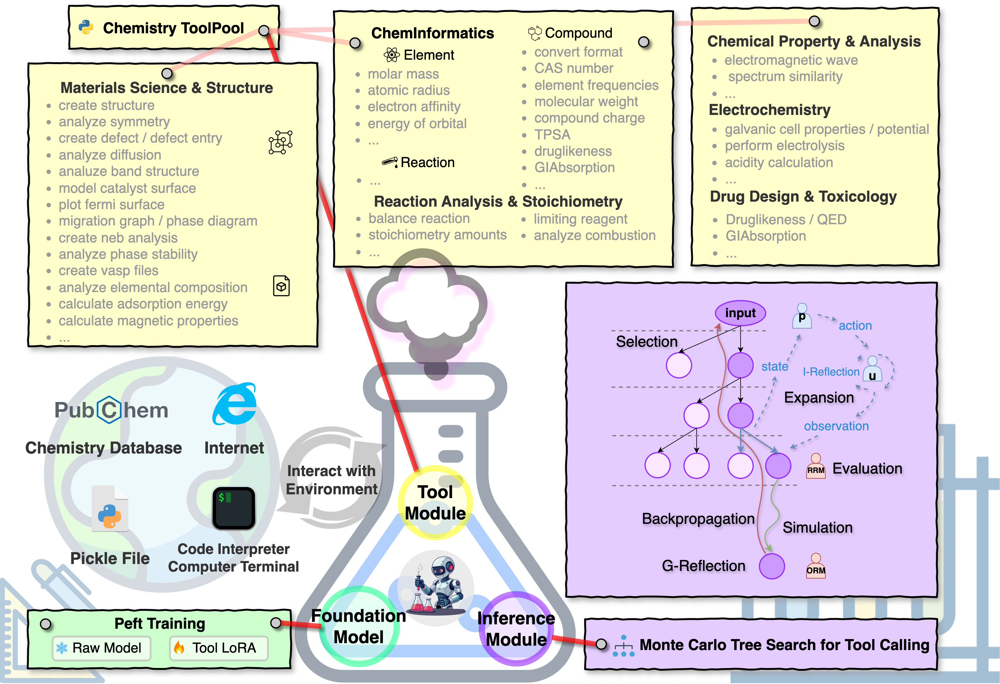

  

# ChemistryAgent

---

## Tool Pool

./toolpool/

Chemistry & Materials Expertise Tools

## Dataset

./dataset/

## Agent

./agent/

Including the ChemAgent Framework: about foundation model, retriever, tool calling module, server, etc.

